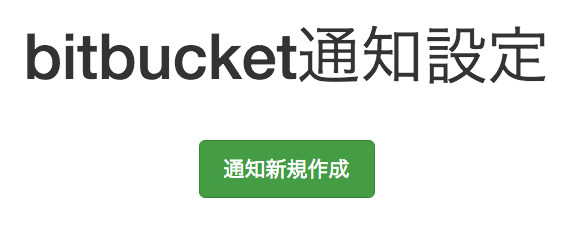
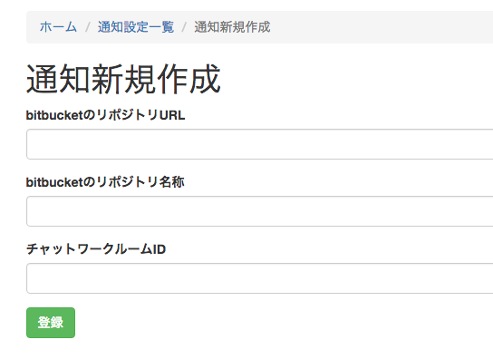
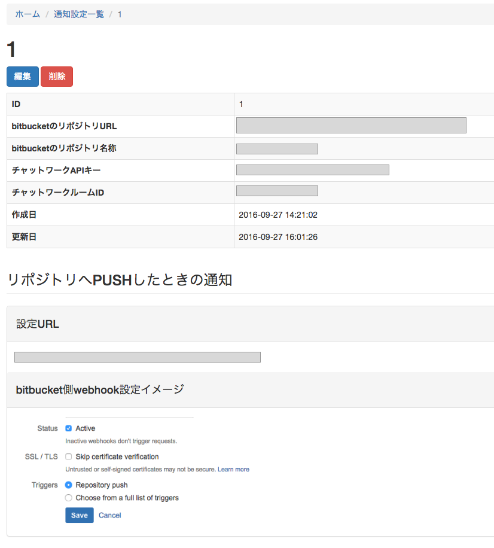

# bitbucket-chatwork通知設定コンソール

## 概要

bitbucketリポジトリのwebhookに該当のURLを設定すると、
下記のアクションをリポジトリに行った場合にチャットワークへ通知してくれるコンソールです。

- リポジトリへPUSH
- issueを登録
- issueを編集
- issueへコメント
- pullリクエストしたとき
- pullリクエストを却下したとき

## 動作確認環境  

### OS

CentOS 6.5以上（※Apache/MySQL/PHPの下記バージョンが動けば他のOSでも可）

### Apache

2.2.15以上

### MySQL

5.6以上

### PHP

5.6以上

## インストール

### ■composerで依存関係ライブラリを取得

#### 1. 下記コマンドをプロジェクトルートディレクトリで実行してcomposerを取得

```  
curl -sS https://getcomposer.org/installer | php
```  
  
#### 2. 下記コマンドでcomposerのプラグインをインストール  
  
```    
php composer.phar global require "fxp/composer-asset-plugin:^1.2.0"
```  

#### 3. 下記コマンドで依存関係ライブラリを取得

```
php composer.phar install
```

### ■初期データの作成

#### 1. cookieValidationKeyの設定

下記箇所へ予測されづらい任意の文字列を追加する。

__ プロジェクトルート/config/web.php 13行目 __
```  
'cookieValidationKey' => '',
```

#### 2. 初期ユーザー設定

下記箇所へ初期ユーザー情報を追加する。  
パスワードはsha1ハッシュされたものを入力する。  
例）  
パスワードに設定したい値：somepassword  
パスワードに記載する値：f8377c90fcfd699f0ddbdcb30c2c9183d2d933ea

__ プロジェクトルート/migrations/m160916_005826_create_user_table.php 28/29行目 __

```
'username' => '',
'password' => '',
```

#### 3. チャットワークAPIキーの設定

チャットワークで取得したAPIキーを下記に追加する。

__プロジェクトルート/migrations/m160926_014402_create_chatwork_api_key_table.php 14行目__

```
const DEFAULT_API_KEY = '';
```

#### 4. データベースの設定

データベースに__chatwork_push__ユーザーを作成し、同名のデータベースを作成する。

作成したデータベースのパスワードを下記に記載する。

__プロジェクトルート/config/db.php 7行目__

```
'password' => '',
```

#### 5. マイグレーションの実行

プロジェクトルートディレクトリで下記コマンドを実行する。

```
php yii migrate
```

## 使用方法

### 通知の作成

#### 1. 通知新規作成ボタンを押下



#### 2. 登録情報を入力

- __bitbucketのリポジトリURL__  
	通知を行うリポジトリのURL

- __bitbucketのリポジトリ名称__  
	通知を行うリポジトリの名称

- __チャットワークルームID__  
	通知先のチャットワークルームID



#### 3. 詳細画面の表示を元にbitbucketサイトにてリポジトリのwebhook設定に各URLを登録する

